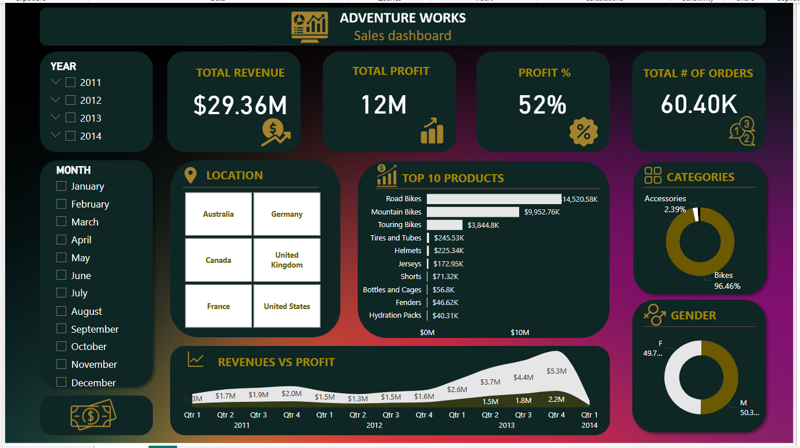

# Adventure Works Sales Dashboard  

This project focuses on analyzing Adventure Works sales data using Power BI. The analysis provides insights into revenue, profits, product performance, and customer distribution across different geographic locations.  

---

## Project Overview  
Raw data has been transformed into an interactive dashboard, offering meaningful insights into sales performance to support data-driven decision-making.  

---

## Key Insights  
This analysis covers various aspects, including:  

- Total Revenue: Track overall sales in dollars.  
- Total Profit: Display net profits achieved.  
- Profit Margin: Analyze overall profit percentage.  
- Total Orders: Count the number of sales orders over time.  
- Product Performance: Rank top-selling products by revenue.  
- Geographic Analysis: Explore sales distribution by country.  
- Category Comparison: Evaluate product category contributions to total revenue.  
- Revenue & Profit Trends: Monitor financial performance over time.  

---

## Tools & Technologies  
- Power BI – For creating visualizations and dashboards.  
- Power Query – For data cleaning and transformation.  

---

## Dataset  
The dataset used consists of Adventure Works sales data, including order details, customers, products, and geographic market insights.  

---

## How to Use This Dashboard  
1. Download the .pbix file from the repository.  
2. Open it using Power BI Desktop.  
3. Interact with slicers and filters to explore different data dimensions.  

---

## Dashboard Preview  

